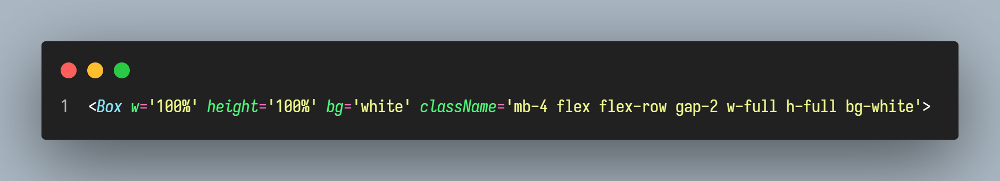

# ❤️ SOME RULES FOR CODING HAPPIER AND PROFESSIONAL ❤️

## 1. Sorting import

- Noop. It too hard to find something

  

- Good. Sorting import separate by from library and from project

  

## 2. Import at highest folder level

- Noop. It too long import

  

- Good. It will help shorter import

  

## 3. Create a index file at highest folder level to export all children folder

- Noop. Too much import line

  

- Good. Only one line import

  

## 4. Only one folder components is accepted in each screen

- Noop. It will make project structure are repeated and
  nested together

  

- Good. Only have a components folder to store any component using at this screen

  

## 5. Use one kind of styles for apply css, limit use unnecessary className, and use config value if possible and not have any problem

- Noop. It will make my code in each line too long

  

- Good. It will sorter and easy to fix when maintain code.

  

## 6. Split any code is too long or for any purpose for readable and maintain code after that

- Noop. This code is too long

  
  

- Good. It will make easy to read and know what is purple of this component

  
  

## 6. Create a function for pass into a component

- Noop. This code is too long

  

- Good. It will make easy to read and know what is purple of this component

  

## 6. Using declare type for meaningful

- Noop

  

- Good

  

---

**NOTE**

- I will update more and more rules soon. Thank for reading ❤️

---

## 📄 Some useful documents

- https://www.ssw.com.au/rules/rules-to-better-react/
- https://dev.to/sathishskdev/part-1-naming-conventions-the-foundation-of-clean-code-51ng
- https://dev.to/sathishskdev/part-2-folder-structure-building-a-solid-foundation-omh
- https://dev.to/sathishskdev/part-3-component-structure-building-reusable-and-maintainable-components-in-react-54n6
- https://dev.to/sathishskdev/part-4-writing-clean-and-efficient-react-code-best-practices-and-optimization-techniques-423d
- https://betterprogramming.pub/21-best-practices-for-a-clean-react-project-df788a682fb
